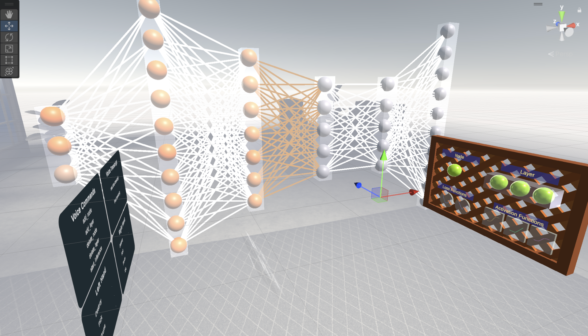

# XRNN: VR Neural Network Visualization

<div align="center">
  
</div>

<br>

**XRNN** is a Virtual Reality application designed to visualize and interact with neural networks in 3D space. Developed using **Unity** and **Python**, this tool allows users to manipulate and observe the behavior of a simple neural network in real-time, leveraging gesture recognition for intuitive interaction.

> **Academic Project**  
> Developed for the *Advanced Human-Computer Interaction* course at the **University of Trento (UNITN)**, Academic Year 2024-2025.

## 🚀 Features

*   **Immersive Visualization**: View the structure and activations of a neural network in a fully immersive VR environment.
*   **Interactive Control**: Interact with the network using hand gestures, processed via an external Python server.
*   **Real-Time Bridge**: Seamless communication between the Unity frontend (VR) and the Python backend (Model & Gesture Recognition).

## 🛠️ Tech Stack

*   **Frontend**: Unity (C#, ShaderLab)
*   **Backend**: Python (Jupyter Notebooks)
*   **XR SDK**: Meta XR All-in-One SDK

## 💻 Getting Started

This application consists of two parts: a **Python Backend** (for the model and gesture recognition) and a **Unity Frontend** (for the VR experience). Both must be running for the application to function correctly.

### Prerequisites
*   Unity (Version compatible with the project settings)
*   Python 3.x
*   Jupyter Notebook
*   A VR Headset compatible with Meta XR (e.g., Meta Quest)

### Installation & Usage

#### 1. Start the Python Backend
The Unity application relies on a local server for gesture recognition and neural network computations.

1.  Navigate to the `python/` directory.
2.  Open and run the model notebook:
    ```bash
    jupyter notebook python/model.ipynb
    ```
3.  Open and run the gesture recognition server:
    ```bash
    jupyter notebook python/gestures/recognizerServer.ipynb
    ```
    *Ensure the server is active and listening before starting Unity.*

#### 2. Launch the Unity Application
1.  Open the project folder in **Unity Hub**.
2.  Load the main scene.
3.  Press **Play** in the Unity Editor (or build and deploy to your VR headset).

## 📦 Assets & Dependencies

This project utilizes several high-quality assets from the Unity Asset Store to enhance the development environment and visual fidelity:

| Asset Name | Description | Link |
| :--- | :--- | :--- |
| **Meta XR All-in-One SDK** | Core SDK for VR/MR development | [View Asset](https://assetstore.unity.com/packages/tools/integration/meta-xr-all-in-one-sdk-269657) |
| **Editor Attributes** | Enhances the Unity Inspector workflow | [View Asset](https://assetstore.unity.com/packages/tools/gui/editorattributes-269285) |
| **Factory Tools** | Low-poly industrial props for the environment | [View Asset](https://assetstore.unity.com/packages/3d/props/industrial/workshop-tools-free-low-poly-asset-pack-326488) |

## 👨‍💻 Maintainers

*   **Andrea** - [GitHub Profile](https://github.com/andreaunitn)
*   **Michele** - [GitHub Profile](https://github.com/lamon22)

## 📄 License

This project is licensed under the [MIT License](LICENSE).
